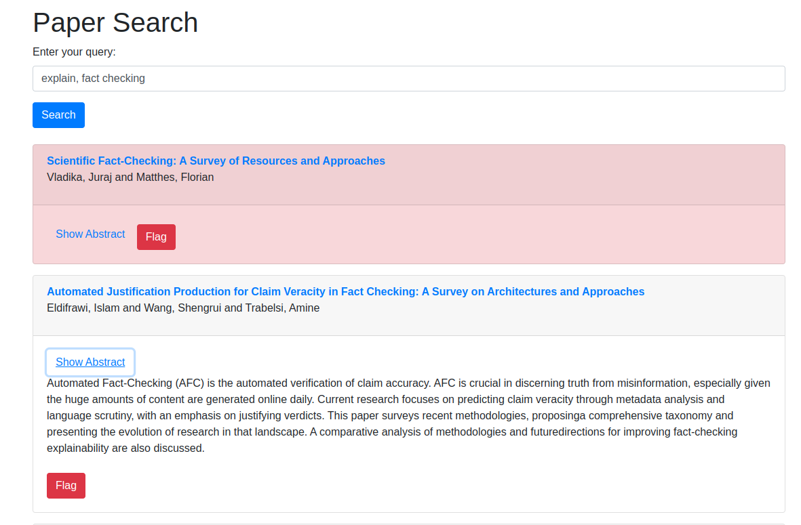

# AutoRA: Unlocking Smarter Research with Automated Paper Search and Analysis

## Features

- [x] Fetch the complete conference proceedings from the DBLP and ACL Anthology.
- [x] Perform semantic search based on your keywords of interest with the help of LLMs.
- [x] Perform the semantic search from a Flask-based portal.
- [x] Flag the interested papers with red background.
- [ ] Improve the presentation of the Flask-based portal by better formatting the special characters.
- [ ] Improve the user friendliness of the system by automating everything except (1) creating the environment, and (2) `python app.py`.

